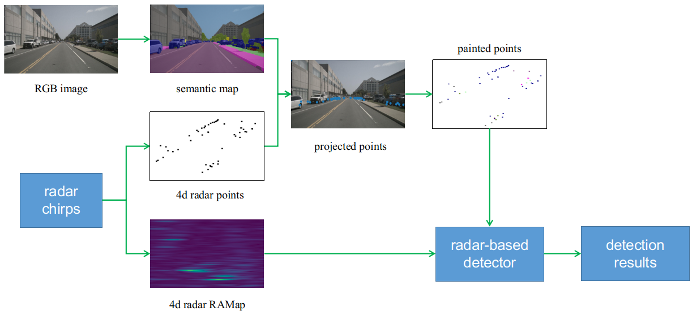

# CRFDet

## Introduction

This is a camera-radar fusion detection framework based on [nuscenes](https://www.nuscenes.org). It consists of three main stages: (1) RGB-based segmentation results, (2) fusion model, and (3) radar-based detector. Firstly, we generate image semantics map based on [mmsegmentation](https://github.com/open-mmlab/mmsegmentation). Secondly, radar points are projected to the map to obtain painted points that contain class channel. Then, these painted points are  projected to radar RAMap to decrease false alarm rate.  Finally, we propose a RAMap-based detector to generate object class and location information.


## Requirements

* Ubuntu 18.04
* CUDA 10.1

## Quick Start

1. [Download](https://www.nuscenes.org/download) the dataset or prepare our own dataset like nuscenes.

2. [Download](https://download.openmmlab.com/mmsegmentation/v0.5/pspnet/pspnet_r50-d8_512x1024_40k_cityscapes/pspnet_r50-d8_512x1024_40k_cityscapes_20200605_003338-2966598c.pth) the segmentation model checkpoint and place it in  `checkpoint/`.

3. Establish environment.

```python
conda env create -n crfdet python=3.7.9 
pip install -r requirements.txt
```

4. Infer an exmple.

```python
python demo.py
```

## TODO

- [ ] radar-based detector

## References

https://github.com/open-mmlab/mmsegmentation  
https://github.com/nutonomy/nuscenes-devkit
